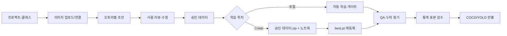

# 경험 지도

## 핵심 상태

| 구간 | 정상 상태 | 실패·부분 상태 | 사용자가 할 수 있어야 하는 일 |
|---|---|---|---|
| 입력 | 이미지 수와 클래스 표시 | 손상 파일·원본 누락 | 실패 파일 확인·재시도 |
| 오토라벨 | 진행률·엔진·프로필 표시 | 실패·중단 | 재실행, 사람 라벨 보존 |
| 리뷰 | 저장 상태·현재 위치 표시 | 저장 실패 | 자동 재시도·이탈 경고·되돌리기 |
| 학습 | 로컬/Colab 경로 구분 | 조건 미달·게이트 탈락 | 데이터 패키지 확인·모델 재등록 |
| 통계 검수 | 표본만 표시·판정 진행률 | 로트 변경 | 새 계획 생성·판정 수정 |
| 반출 | 포함 장수·누락 수 표시 | 원본 누락·옛 클래스 | 문제를 보고 수정 후 재반출 |
